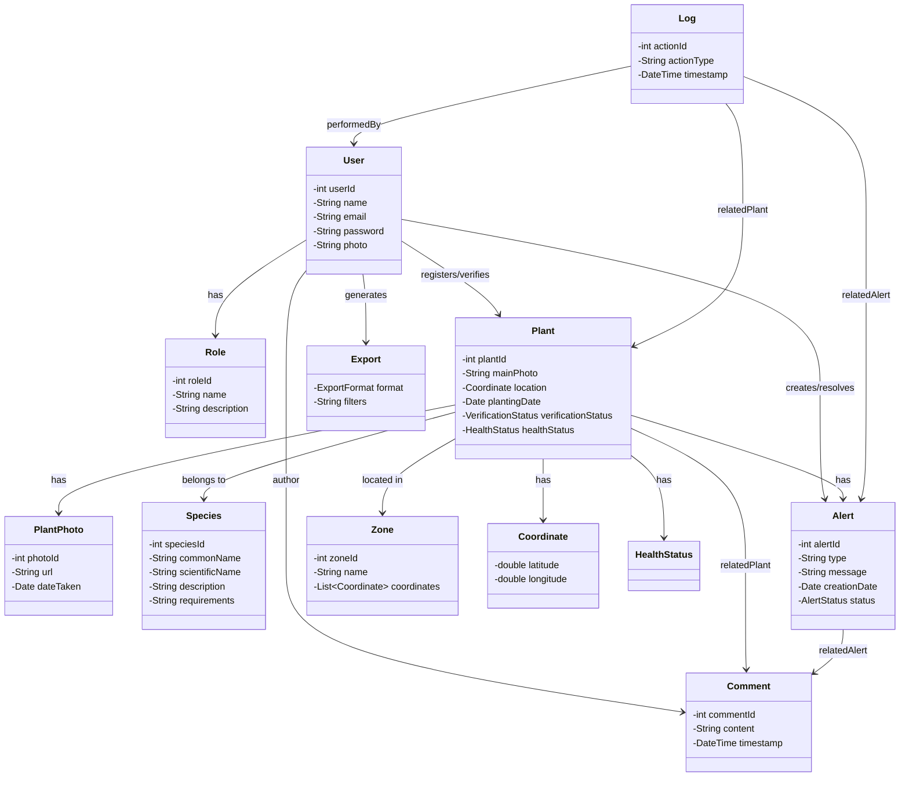

# Modelo UML Counting Tree

---

# Modelo UML completo Contando Árboles (Counting Tree) – actualizado

## Clases

### User
- userId : int
- name : String
- email : String
- password : String
- role : Role
- photo : String  # URL o ruta de la foto de perfil

### Role
- roleId : int
- name : String
- description : String

### Plant
- plantId : int
- mainPhoto : String
- location : Coordinate
- plantingDate : Date
- verificationStatus : VerificationStatus
- healthStatus : HealthStatus
- photos : List<PlantPhoto>

### PlantPhoto
- photoId : int
- url : String
- dateTaken : Date
- comment : String
- plant : Plant

### Species
- speciesId : int
- commonName : String
- scientificName : String
- description : String
- requirements : String

### Alert
- alertId : int
- type : String
- creationDate : Date
- status : AlertStatus

### Zone
- zoneId : int
- name : String
- coordinates : List<Coordinate>

### Comment
- commentId : int
- content : String
- timestamp : DateTime
- author : User
- relatedPlant : Plant (optional)
- relatedAlert : Alert (optional)

### Log
- actionId : int
- actionType : String
- timestamp : DateTime
- performedBy : User
- relatedPlant : Plant (optional)
- relatedAlert : Alert (optional)

### Export
- format : ExportFormat
- filters : String
- generatedBy : User

### Coordinate
- latitude : double
- longitude : double

---

## Relaciones (multiplicidades)

- Role 1 → 0..* User

- User 1 → 0..* Plant (registers/verifies)
- User 1 → 0..* Alert (creates)
- User 1 → 0..* Alert (resolves)
- User 1 → 0..* Comment (author)

- Plant 0..* → 1 Species (belongs to)
- Plant 0..* → 1 Zone (located in)
- Plant 0..* → 1 HealthStatus (has)
- Plant 0..* → 0..* Alert (has)
- Plant 1 → 0..* Comment (relatedPlant)
- Plant 1 → 0..* PlantPhoto (has)
- Plant 1 → 1 Location (has)

- Alert 0..* → 1 AlertStatus (has)

- Log 0..* → 1 User (performedBy)
- Log 0..* → 1 Plant (relatedPlant)
- Log 0..* → 1 Alert (relatedAlert)

- Export 0..* → 1 User (generatedBy)

---

## Enums

### VerificationStatus
- PENDING
- VERIFIED
- REJECTED

### AlertStatus
- PENDING
- IN_PROGRESS
- RESOLVED
- CANCELLED

### ExportFormat
- EXCEL
- PDF
- CSV
